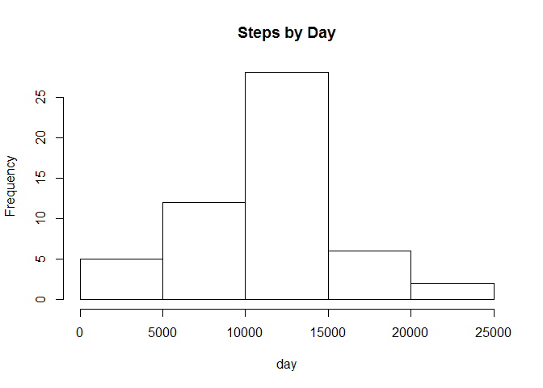
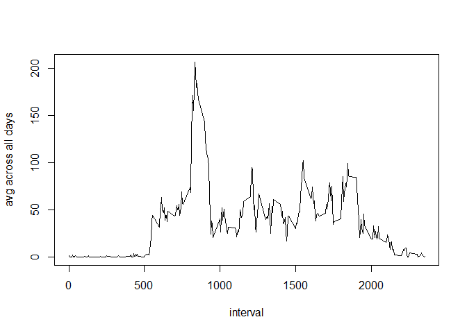
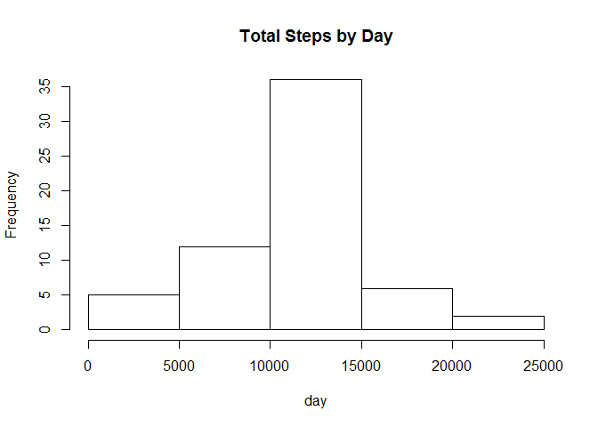
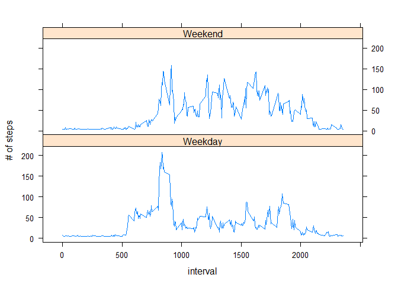

# Reproducible Research: Peer Assessment 1


## Loading and preprocessing the data

Read the activity data using the read.csv function. Ensure that R understands the date format properly by using as.Date function.


```r
directory <- 'C:/Users/EMF/Documents/R/CourseraReproResearch/Peer Assessment 1'
file <- 'activity.csv'

data <- read.csv(paste(directory,'/',file,sep=''))

#fix date format
data$date <- as.Date(data$date, '%Y-%m-%d')
```


## What is mean total number of steps taken per day?

1. Calculate the total number of steps taken per day


```r
#aggregate the data
by.Day <- aggregate(steps ~ date, data = data, sum, na.rm=TRUE)
```

2. Make histogram of total number of steps taken


```r
#create histogram
hist(by.Day$steps, main= 'Steps by Day', xlab='day')
```

 

3. Report the mean and meidan of the steps taken per day


```r
#calculate mean steps per day
mean.Steps <- mean(by.Day$steps)
mean.Steps
```

```
## [1] 10766.19
```

## What is the average daily activity pattern?

1. Make time series plot of 5-minute intervals (x axis) and the average number of steps taken, averaged across all days (y-axis)


```r
#create the time series data using tapply function to apply the mean function
time.Series <- tapply(data$steps, data$interval, mean, na.rm= TRUE)

#plot the time series
plot(row.names(time.Series), time.Series, type = 'l', xlab='interval', ylab='avg across all days')
```

 

```r
plot
```

```
## function (x, y, ...) 
## UseMethod("plot")
## <bytecode: 0x0000000006ae8900>
## <environment: namespace:graphics>
```

2. Which 5-minute interval, on average across all the days in the dataset, contains the maximum number of steps?


```r
#select the max value in time series
max.interval <- which.max(time.Series)

#access the value
names(max.interval)
```

```
## [1] "835"
```


## Imputing missing values


1. Calculate and report the total number of missing values in the dataset (i.e. the total number of rows with NAs)


```r
#count the NA values
data.NA <- sum(is.na(data))
data.NA
```

```
## [1] 2304
```

2. Devise a strategy for filling in all of the missing values in the dataset. The strategy does not need to be sophisticated. For example, you could use the mean/median for that day, or the mean for that 5-minute interval, etc.


```r
#calculate the overall mean steps per interval

interval.mean <- sum(by.Day$steps)/nrow(by.Day)/288

#replace NA values with this average

data2 <- data

for (i in 1:nrow(data2)) {
      if (is.na(data2$steps[i])){
            data2$steps[i] <- interval.mean
            
      }
      
      data2
}
```


3. Create a new dataset that is equal to the original dataset but with the missing data filled in.


```r
data.noNA <- data2
```

4. Make a histogram of the total number of steps taken each day and Calculate and report the mean and median total number of steps taken per day. Do these values differ from the estimates from the first part of the assignment? What is the impact of imputing missing data on the estimates of the total daily number of steps?


```r
#create histogram

data.noNAhist <- aggregate(steps ~ date, data = data.noNA, sum, na.rm=TRUE)
hist(data.noNAhist$steps, main= 'Total Steps by Day', xlab='day')
```

 

```r
#mean and median
mean.StepsnoNA <- mean(data.noNAhist$steps)
mean.StepsnoNA
```

```
## [1] 10766.19
```

```r
median.StepsnoNA <- median(data.noNAhist$steps)
median.StepsnoNA
```

```
## [1] 10766.19
```


## Are there differences in activity patterns between weekdays and weekends?

1. Create new factor variable in the dataset with two levels -- 'weekday' and 'weekend' indicating whether a given date is a weekday or a weekend day


```r
#find the day of the week for each day and create vector
day <- weekdays(data.noNA$date)
level.day <- vector()

#use a for loop to loop through the data and assign the correct level to each day
for(i in 1:nrow(data.noNA)) {
      if(day[i] == 'Saturday') {
            level.day[i] <- 'Weekend'
      } else if (day[i] == 'Sunday') {
            level.day[i] <- 'Weekend'
      } else {
            level.day[i] <- 'Weekday'
      }
}

#add the level.day factor to the data frame

data.noNA$dayLevel <- level.day
```


2. Make a panel plot containing a time series plot (i.e. type = "l") of the 5-minute interval (x-axis) and the average number of steps taken, averaged across all weekday days or weekend days (y-axis). See the README file in the GitHub repository to see an example of what this plot should look like using simulated data.


```r
#aggregate the data for time series

steps.levels <- aggregate(steps ~ interval + dayLevel,
                          data = data.noNA, mean)

library(lattice)
xyplot(steps ~ interval | factor(dayLevel), steps.levels, type='l',
       layout = c(1,2), xlab = "interval", ylab = '# of steps')
```

 
